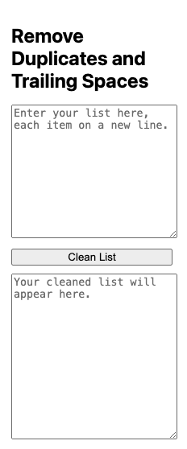

# Chrome Extension: Remove Duplicates and Trailing Spaces

## Overview
This Chrome extension allows you to remove duplicates and trailing spaces from a list of words or IP addresses.

## How to Use
1. Clone or download this repository to your computer.
2. Open Chrome and go to `chrome://extensions/`.
3. Enable "Developer mode" in the top right corner.
4. Click on "Load unpacked" and select the folder containing your extension files.
5. The extension icon will appear in the toolbar.
6. Click on the extension icon to open the popup.
7. Enter your list in the input textarea, with each item on a new line.
8. Click the "Clean List" button to remove duplicates and trailing spaces.
9. The cleaned list will be displayed in the output textarea.

## Screenshots

## Contributing
If you'd like to contribute to the development of this extension, please follow these steps:
1. Fork the repository.
2. Create a new branch for your feature or bug fix.
3. Make changes and submit a pull request.

## License
This project is licensed under the [MIT License](LICENSE).

---

**Made with ❤️ by Raunak kapoor*
